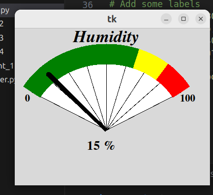

###Smarter Gauge
------
Descripation:
This example is an implementation to an analog gauge with a needle using canvas widget .it create a rondom value from 0 to 100 and the neede move depend on the created value.
____
####GUI
 
